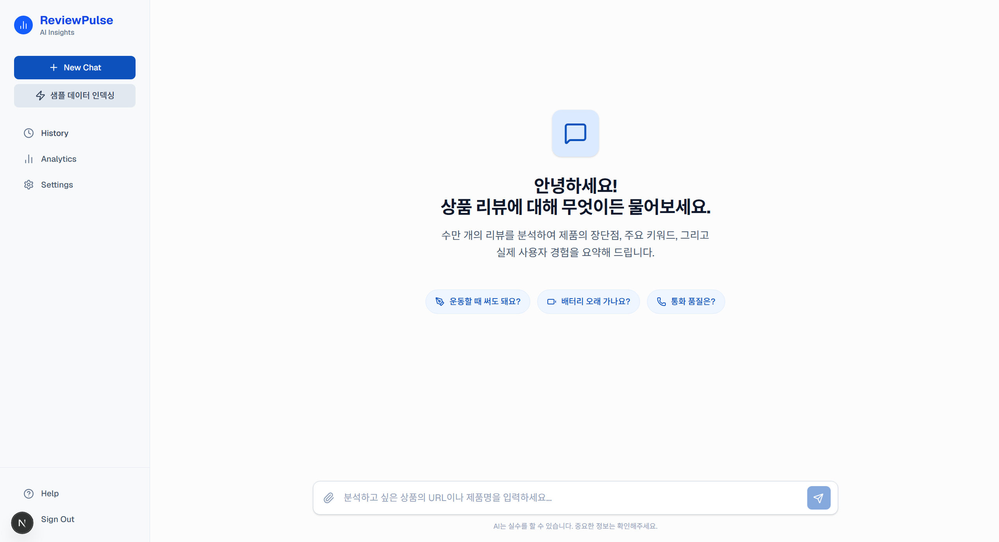
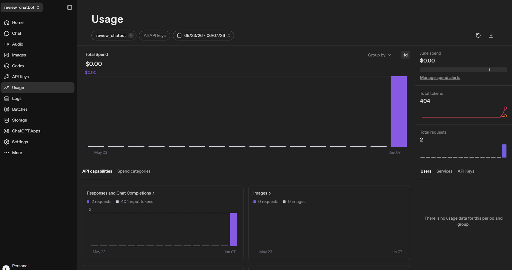
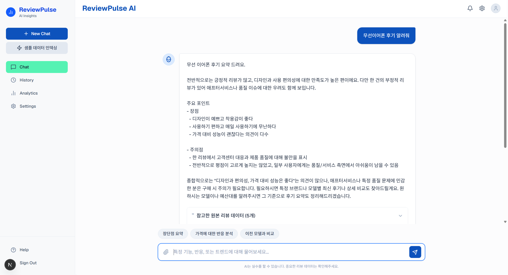

# 🛒 Shopping Review Chatbot

사용자의 쇼핑 경험을 향상시키기 위해 작성된 리뷰 데이터를 기반으로 질의응답을 제공하는 **지능형 쇼핑 리뷰 챗봇**입니다. OpenAI의 강력한 언어 모델과 Pinecone 벡터 데이터베이스를 활용한 RAG(Retrieval-Augmented Generation) 기술을 적용하여, 방대한 리뷰 속에서 사용자에게 가장 정확하고 유용한 정보를 추출해 답변합니다.

<p align="center">
  
</p>

## ✨ 핵심 기능 (Key Features)

### 1. OpenAI 연동을 통한 자연스러운 대화
OpenAI의 LLM을 연동하여 사용자의 질문 의도를 정확하게 파악하고, 마치 사람과 대화하는 듯한 자연스러운 응답을 제공합니다.

<p align="center">
  
</p>

### 2. RAG 기반 맞춤형 리뷰 검색 시스템
단순한 키워드 검색을 넘어, 사용자의 질문과 의미적으로 가장 유사한 리뷰 데이터를 Pinecone 벡터 데이터베이스에서 검색한 후, 이를 바탕으로 답변을 생성하는 RAG 구조를 구현했습니다. 실제 리뷰 데이터를 바탕으로 환각 현상(Hallucination)을 최소화한 신뢰도 높은 답변을 제공합니다.

<p align="center">
  
</p>

## 🛠 사용 기술 (Tech Stack)

### Frontend
- **Framework**: Next.js 16
- **Library**: React 19
- **Styling**: TailwindCSS 4
- **Icons**: Lucide React

### Backend / Database
- **Database / Auth**: Supabase
- **Vector Database**: Pinecone
- **Data Processing**: csv-parse

### AI / ML
- **LLM**: OpenAI API
- **Framework**: LangChain, LangChain OpenAI, LangChain Pinecone

## 🚀 시작하기 (Getting Started)

### 1. 저장소 클론 (Clone the repository)
```bash
git clone https://github.com/your-username/shopping_review_chatbot.git
cd shopping_review_chatbot
```

### 2. 패키지 설치 (Install dependencies)
```bash
npm install
```

### 3. 환경 변수 설정 (Environment Variables)
프로젝트 루트 폴더에 `.env.local` 파일을 생성하고 다음 환경 변수들을 설정합니다:
```env
OPENAI_API_KEY=your_openai_api_key
PINECONE_API_KEY=your_pinecone_api_key
PINECONE_INDEX=your_pinecone_index
NEXT_PUBLIC_SUPABASE_URL=your_supabase_url
NEXT_PUBLIC_SUPABASE_ANON_KEY=your_supabase_anon_key
```

### 4. 개발 서버 실행 (Run development server)
```bash
npm run dev
```
브라우저에서 `http://localhost:3000`으로 접속하여 확인합니다.

## 📂 프로젝트 주요 구조 (Project Structure)
- `app/`: Next.js 라우팅 및 페이지, UI 컴포넌트
- `asset/`: README 이미지 등 각종 정적 리소스 파일 모음
- `samples/`: 테스트 및 임베딩용 리뷰 CSV 샘플 데이터
- `public/`: 웹에서 접근 가능한 공통 정적 파일
